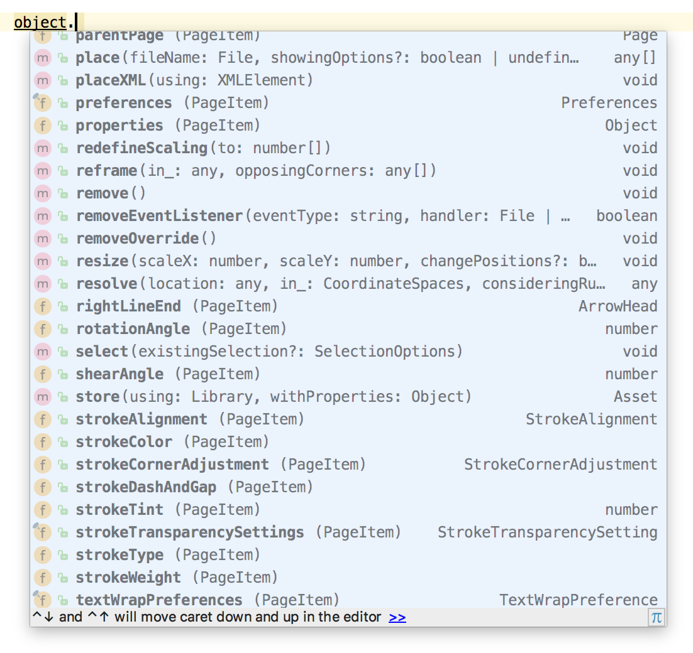

# TypeScript types for Adobe Products [](https://travis-ci.org/pravdomil/types-for-adobe)
[](http://youtu.be/h-c7A8pQzx8)

## Prerequisites
Install [Node.js](https://nodejs.org/en/download/) and [TypeScript](https://www.typescriptlang.org/#download-links).

## Your first script for eg. Adobe Illustrator
```bash
# create new folder
mkdir my-script
cd my-script

# install types-for-adobe
npm init -y
npm i pravdomil/types-for-adobe

# create tsconfig.json
printf '{"compilerOptions":{"module":"none","noLib":true}}' > tsconfig.json

# create index.ts
printf '/// <reference types="types-for-adobe/illustrator/2015.3"/>\nalert(String(app))' > index.ts
# change to Adobe product you're targeting

# compile typescript files
tsc

# open Adobe Illustrator -> File -> Scripts -> Other Script -> and select index.js
```

## CSInterface
For typings for CSInterface check [BrightShadow/CSInterface-TS](https://github.com/BrightShadow/CSInterface-TS).

## Autocomplete works


## Contributors
Thanks to [vespakoen](https://github.com/vespakoen), [atarabi](https://github.com/atarabi).

## Note
Declaration files is generated by [extendscript-xml-to-typescript converter](https://github.com/pravdomil/extendscript-xml-to-typescript).

Definitions was created in summer 2017 by [Pravdomil.com](https://pravdomil.com).

You can [buy a beer for him](https://www.paypal.com/cgi-bin/webscr?cmd=_s-xclick&hosted_button_id=BCL2X3AFQBAP2&item_name=types-for-adobe%20Beer).
